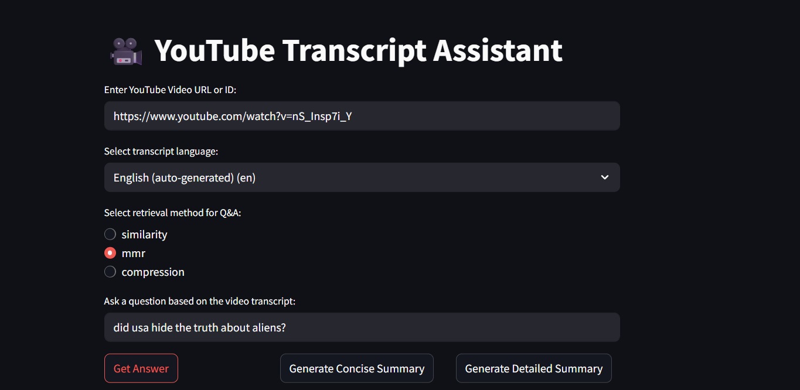

# 🎥 YouTube ChatBot



YouTube Transcript Assistant is a Streamlit-based AI tool that helps you:

- ✅ Ask questions about YouTube video content
- ✅ Generate **concise** or **detailed summaries**
- ✅ Detect available transcript languages and choose which one to interact in
- ✅ Get answers or summaries in the language of your choice

Built with LangChain, FAISS, and Google's Gemini 1.5 Flash model.

---

## 📂 Project Structure

.
├── ui.py # Main Streamlit interface
├── chatbot.py # Core logic and chains
├── summarization_chain.py # Hierarchical summarization logic
├── .env # Stores environment variables like API keys
├── .gitignore # Ignores .env and other files
├── requirements.txt # Required Python packages
└── README.md # You're reading it!

markdown
Copy
Edit

---

## 🔧 Requirements

These libraries are used in the project:

- `streamlit`
- `langchain`
- `langchain-core`
- `langchain-community`
- `langchain-google-genai`
- `faiss-cpu`
- `python-dotenv`
- `youtube-transcript-api`

Install them via:

```bash
pip install -r requirements.txt
🚀 Running the App
1. Clone the repository
bash
Copy
Edit
git clone https://github.com/Soulpurr/YouTubeChatBot.git
cd youtube-transcript-assistant
2. Set up the .env file
Create a .env file in the root directory and add your Google Gemini API key:

ini
Copy
Edit
GOOGLE_API_KEY=your_api_key_here
3. Launch the app
bash
Copy
Edit
streamlit run ui.py
🧠 Features
🔍 Multilingual Support: See all languages available for a video and chat in any of them.

💬 Q&A Mode: Ask any question related to the transcript using three different retrieval modes.

🧾 Concise & Detailed Summaries: Choose the granularity of your summary.

📚 Compression Retrieval: Optionally compress context using Gemini before answering.

📸 Image Preview
Place your screenshot in the assets/preview.png location (or update the image path above).

🙌 Contributing
Pull requests are welcome! Feel free to open issues or suggest features.

📄 License
MIT License © 2025 Your Name

pgsql
Copy
Edit

Let me know if you want to include badges (e.g., Streamlit Cloud, Python version, Gemini), or if you want a `requirements.txt` file generated too.
